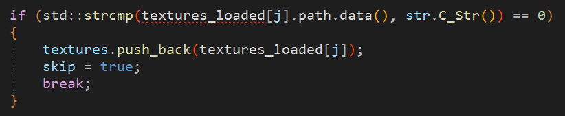

根据LearnOpenGL教程编写`model.h`头文件时，在对比已导入纹理`textures_loaded`和当前导入`str.C_Str()`时出现问题

**问题**：VS报错 明显调用的表达式前的括号必须具有(指针)函数类型的一种

如图：

**修改方式**：调用结构体成员时不需要加括号，即`textures_loaded[j].path.data`

报错解决

参考：https://blog.csdn.net/weixin_47212736/article/details/117675058
