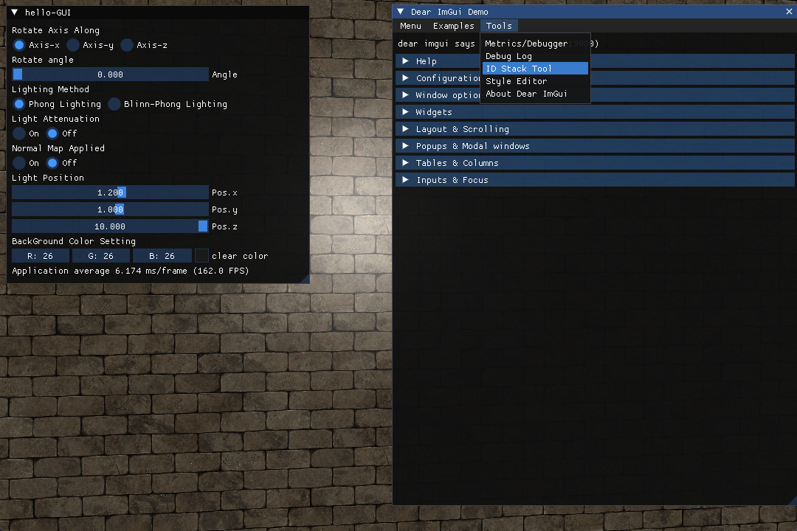
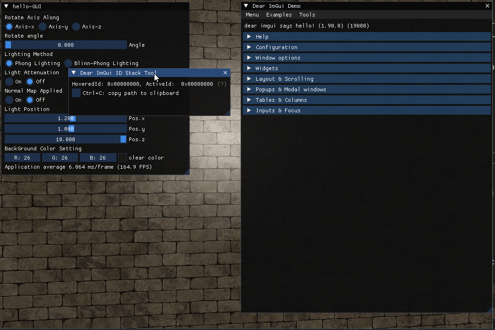

#error #opengl #imgui

---
## 问题描述

在 VS2020 的 LearnOpenGL 库的 5-4-NormalMapping 项目中

利用 ImGui 的 RadioButton 控件添加了多个单选控件，代码如下：

```cpp
ImGui::Text("Light Attenuation");
ImGui::RadioButton("On", &decay, 1); ImGui::SameLine();
ImGui::RadioButton("Off", &decay, 0);
// ----
ImGui::Text("Normal Map Applied");
ImGui::RadioButton("On", &setNormalMap, 1); ImGui::SameLine();
ImGui::RadioButton("Off", &setNormalMap, 0);
```

然而在运行中出现了 `Normal Map Applied` 的单选按钮无响应的情况，如下图：


## 问题解决

- ImGui 中的每一个控件都会有一个 unique 的 ID，而这个 ID 又是和控件中的 string label 一一对应的，如下代码所示
```cpp
Begin("MyWindow");
Button("OK");          // Label = "OK",     ID = hash of ("MyWindow", "OK")
Button("Cancel");      // Label = "Cancel", ID = hash of ("MyWindow", "Cancel")
End();
```

而在我的程序中，我将 `Light Attenuation` 和 `Normal Map Applied` 的两个 RadioButton 控件都分别命名为了 `on` 和 `off` 这就导致了这两个 Button 的 ID 冲突，类似如下代码所示：
```cpp
Begin("MyWindow");
Button("OK");
Button("OK");      // ERROR: ID collision with the first button! Interacting with either button will trigger the first one.
Button("");        // ERROR: ID collision with Begin("MyWindow")!
End();
```

调用 ImGui 的 ID Stack Tool 来观察控件的 ID：
启用该界面代码如下：
```cpp
bool show_demo_window = true;
// -------
while(!glfwWindowShouldClose(myWindow.window))
	// ...
	ImGui::ShowDemoWindow(&show_demo_window);
	// ...
```

观察到 ID 冲突：

修改后代码如下：
```cpp
ImGui::Text("Light Attenuation");
ImGui::RadioButton("On", &decay, 1); ImGui::SameLine();
ImGui::RadioButton("Off", &decay, 0);
// ----
ImGui::Text("Normal Map Applied");
ImGui::RadioButton("On", &setNormalMap, 1); ImGui::SameLine();
ImGui::RadioButton("Off", &setNormalMap, 0);
```

控件正常：

## 参考链接

- [Table with Radio Button/CheckBox · Issue #4172 · ocornut/imgui · GitHub](https://github.com/ocornut/imgui/issues/4172)
- [FAQ.md#q-why-is-my-widget-not-reacting-when-i-click-on-it at master · ocornut/imgui · GitHub](https://github.com/ocornut/imgui/blob/master/docs/FAQ.md#q-why-is-my-widget-not-reacting-when-i-click-on-it)
