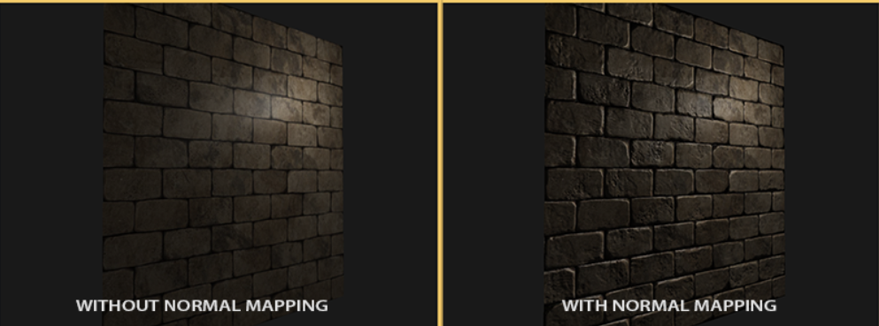
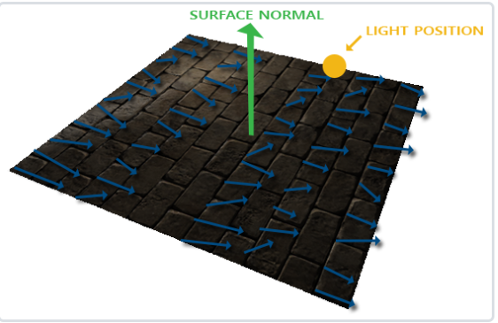
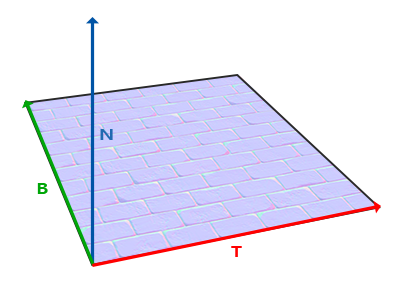

#cg #opengl 

---
# 法线贴图

**法线贴图 Normal Mapping**

## 什么是法线贴图？

记录了物体表面的法线数据的贴图

纹理一般只存储颜色信息，如rgb代表一个3D向量，而法线也是一个3D向量，所以类似的可以将法线的x、y、z存储到纹理中

**需要注意**
- 法线向量范围：$[-1, 1]$
- 颜色向量范围：$[0, 1]$

所以，在存储之前需要将法线映射到 $[0, 1]$

```c
vec3 rgb_normal = normal * 0.5 + 0.5;
```

法线贴图的一个例子如下图所示：

*呈现出这种特殊的颜色的原因*：
- 所有法线都偏向z轴，即 $(0, 0, 1)$，从而呈现出偏蓝的颜色
- 同时法线还向其他方向轻微偏移，从而出现颜色的变化
  - 例如某些偏绿/偏红的位置

---
## 为什么需要法线贴图？

贴图纹理的作用：
- 给三角形增添额外细节，提升真实感
- 同时能够隐藏多边形几何体是无数三角形组成的事实
然而这种贴图无法反映出物体表面的凹凸层次

**思考**：如何用光照系统来表现出物体表面的深度细节？
- 借助*表面法线向量*


通过某种手段将每个fragment的各自的法线信息，存入一个贴图中，这个贴图就叫做**法线贴图（normal mapping）**或**凹凸贴图（bump mapping）**

应用法线贴图的效果对比：


**注意：**
- 借助法线贴图，我们不再需要使用插值表面法线
- 直接从法线贴图中读取法线数据即可

---
## 怎么实现法线贴图？怎么用法线贴图？

和其他贴图的使用方式类似，

```c
uniform sampelr2D normalMap;

void main()
{
    // 从法线贴图获取法线
    normal = texture(normalMap, fs_in.TexCoords).rgb;
    // 法线范围转换回[-1, 1]
    normal = normalize(normal * 2.0 - 1.0);

    /*
    正常处理光照部分。。。
    */
}
```

主要是想要从其中获取发现数据

---
## 法线贴图存在的问题

法线贴图中，正如我们看到的，整体呈现出偏蓝色的色调，也就是说在图片中以 RGB 存储的法线向量，在 z 轴上分量是最大的

这也就导致，我们在程序中读取的法线向量总是朝着一个固定方向，而和具体贴图应用在哪个面，这个面又朝着哪里无关了，*这显然会造成光照的错误计算结果*

示意图如下：

## 如何解决法线贴图的这一问题？

方法一：针对每个应用了法线贴图的面进行单独的变换操作
- 弊端：例如给一个立方体应用法线贴图，则其 6 个面都需要进行变换
- 显然是比较麻烦的解决方式

方法二：利用一个坐标空间，在这个坐标空间中法线贴图的法线方向总是正确的
- **切线空间 tangent space**

---
# 切线空间
## 什么是切线空间？

法线贴图中的法线向量定义在切线空间中，在该空间，法线永远指向正 z 方向

已知上向量为表面的法线向量，右向量为切线向量 tangent，前向量为副切线向量 Bitangent ，如下图所示：

## 为什么需要切线空间？

在应用法线贴图时，由于贴图中的法线向量永远指向正 z 轴，即这一向量是固定的，而实际上在世界空间中可能应用到该贴图的表面可能无法保证其法线一定是正 z 轴方向的，这就导致了我们不能直接使用贴图中的法线数据，而需要进行转换。

于是定义一个法线向量永远指向正 z 轴的坐标空间，命名为法线空间，通过建立法线空间到世界空间的变换矩阵，我们就可以求出贴图上任意处法线方向在世界坐标中的向量

从而解决了法线向量无法适配多种表面朝向的问题

## 如何实现切线空间？切线空间和世界空间的变换又是怎样的？

要确定一个坐标空间，首先需要确定这个空间的**基矢向量**
- 参考 3 D 数学基础中的[第3章 多个坐标空间](../../../../3D数学基础/第3章%20多个坐标空间.md)


如上图，我们假设此时需要将一个纹理应用到一个栅格化的三角形上，而根据基矢向量的性质，在这一对向量所构成的二维平面上的，任何一个向量都可以用这两个基矢向量表示，两个基矢向量前的系数即为所求向量在这对基矢的坐标空间中的坐标

根据上图，我们可以直接写出 E1 和 E2 两条边在 UV 纹理空间中的坐标分别为（这里以 P2 为出发点）：

$$\begin{align*}
\vec{E_1} = \vec{P_2P_1} = (U_1-U_2, V_1-V_2) = (\Delta U_1, \Delta V_1) \\
\vec{E_2} = \vec{P_2P_3} = (U_3-U_2, V_3-V_2) = (\Delta U_2, \Delta V_2)
\end{align*}$$

字面理解可能比较麻烦，这里给出切线空间的坐标公式：

$$\begin{align*}
\vec{E_1} = \Delta U_1 \vec{T} + \Delta V_1 \vec{B} \\
\vec{E_2} = \Delta U_2 \vec{T} + \Delta V_2 \vec{B}
\end{align*}$$

式中，E 1 和 E2 为栅格化三角形的两个边向量；T、B 为切线空间中的切线和副切线（在这里分别和纹理空间的 UV 轴重合）

可以发现，“*两个基矢向量前的系数即为所求向量在这对基矢的坐标空间中的坐标*”

**注意**：这里的 E1，E 2 为三角形的两条边，以及 T、B，其坐标都是*定义在世界空间中的*

所以，根据切线空间的坐标公式就可以反推出 T、B 这两条基矢的世界坐标表示，利用矩阵形式：

$$\begin{align*}
	\begin{bmatrix*}
		E_{1x} && E_{1y} && E_{1z} \\
		E_{2x} && E_{2y} && E_{2z}
	\end{bmatrix*} &= 
	\begin{bmatrix*}
		\Delta U_1 && \Delta V_1 \\
		\Delta U_2 && \Delta V_2
	\end{bmatrix*} \cdot
	\begin{bmatrix*}
		T_x && T_y && T_z \\
		B_x && B_y && B_z
	\end{bmatrix*} \\
	\begin{bmatrix*}
		T_x && T_y && T_z \\
		B_x && B_y && B_z
	\end{bmatrix*} &= 
	\begin{bmatrix*}
		\Delta U_1 && \Delta V_1 \\
		\Delta U_2 && \Delta V_2
	\end{bmatrix*}^{-1} \cdot
	\begin{bmatrix*}
		E_{1x} && E_{1y} && E_{1z} \\
		E_{2x} && E_{2y} && E_{2z}
	\end{bmatrix*}
\end{align*}$$

而该公式中，三角形的边向量的世界表示和三角形顶点在纹理贴图中的映射坐标都是已知的，故**切线空间的基矢**是可以直接求解得到的

**注意**：这里没有涉及到对 N 也就是法线向量的求解，因为我们在设置顶点属性时所给出的法线向量，就已经是世界空间下的法线向量了，*即切线空间只剩下 T、B 两个基矢未知*

代码实现如下：
```cpp
// positions
glm::vec3 pos1(-1.0, 1.0, 0.0);
glm::vec3 pos2(-1.0, -1.0, 0.0);
glm::vec3 pos3(1.0, -1.0, 0.0);
glm::vec3 pos4(1.0, 1.0, 0.0);
// texture coordinates
glm::vec2 uv1(0.0, 1.0);
glm::vec2 uv2(0.0, 0.0);
glm::vec2 uv3(1.0, 0.0);
glm::vec2 uv4(1.0, 1.0);
// normal vector
glm::vec3 nm(0.0, 0.0, 1.0);
// ---------------- //
/* First Triangle */
// E1, E2, deltaUV1, deltaUV2
glm::vec3 edge1 = pos2 - pos1;
glm::vec3 edge2 = pos3 - pos1;
glm::vec2 deltaUV1 = uv2 - uv1;
glm::vec2 deltaUV2 = uv3 - uv1;
// Calculate T, B
GLfloat f = 1.0f / (deltaUV1.x * deltaUV2.y - deltaUV2.x * deltaUV1.y);
tangent1.x = f * (deltaUV2.y * edge1.x - deltaUV1.y * edge2.x);
tangent1.y = f * (deltaUV2.y * edge1.y - deltaUV1.y * edge2.y);
tangent1.z = f * (deltaUV2.y * edge1.z - deltaUV1.y * edge2.z);
tangent1 = glm::normalize(tangent1);
bitangent1.x = f * (-deltaUV2.x * edge1.x + deltaUV1.x * edge2.x);
bitangent1.y = f * (-deltaUV2.x * edge1.y + deltaUV1.x * edge2.y);
bitangent1.z = f * (-deltaUV2.x * edge1.z + deltaUV1.x * edge2.z);
bitangent1 = glm::normalize(bitangent1);
[...]
// 对平面的第二个三角形采用类似步骤计算切线和副切线
```

## 参考链接

- [切线空间（Tangent Space）完全解析 - 知乎](https://zhuanlan.zhihu.com/p/139593847)
- [切线空间详解 - Alphuae - 博客园](https://www.cnblogs.com/Alphuae/p/16575103.html)
