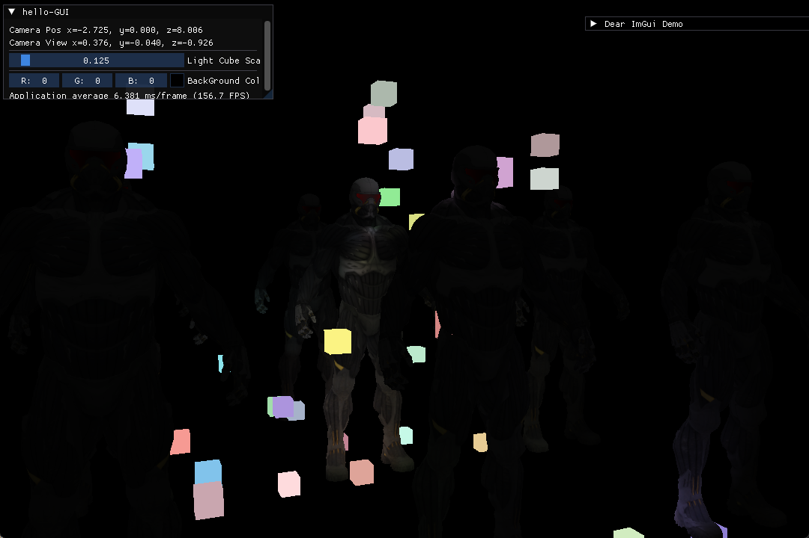

#cg #opengl
- [延迟着色法 - LearnOpenGL CN](https://learnopengl-cn.github.io/05%20Advanced%20Lighting/08%20Deferred%20Shading/)
---
# 延迟着色法
## 什么是延迟着色？

**延迟着色 Deferred Shading**：基于想要将大部分计算量很大的渲染（例如光照）*延迟 Defer*或*推迟 Postpone*到后期处理的想法，从而减少不必要的渲染调用的一种加速渲染复杂场景的渲染技巧。

## 为什么需要延迟着色？

区别于之前计算光照方式时使用的方式（**正向渲染 Forward Rendering**或**正向着色法 Forward Shading**），正向渲染是一种直接渲染物体的方式，步骤如下：
- 计算一个物体的光照时，对场景中全部光源进行迭代计算
- 随后渲染下一个物体，继续对场景中光源迭代
如果这个场景中有 $n$ 个物体，光源有 $m$ 个，则正向着色法在该场景中的计算复杂度为 $O(n\cdot m)$，这开销是非常大的。原因在于：
  - 正向渲染是先计算每个物体，再进行深度测试去掉不需要的片段
  - 也就是正向过程中，不少的计算量被分配在了渲染那些最后输出时用不上的片段
*如果能够提前确定场景中物体之间的重叠或者深度信息，那我们是否可以通过某种只对这些露出来的位置进行光照计算呢？*

**延迟着色法**，就是为了解决该问题

因为在几何处理阶段已经获取了片段的位置信息等，此时已经有了深度测试结果。后续在光照处理阶段时，这时候计算的片段的光照信息都是最终会显示出来的片段颜色，从而保证了在此阶段，*每一个像素都只进行一次光照计算*，相比于正向渲染方式，避免了无用的渲染调用

```cpp
while(Rendering)
// 1.Geometry Pass
	glBindFramebuffer(GL_FRAMEBUFFER, gBuffer);
	glClear(GL_COLOR_BUFFER_BIT | GL_DEPTH_BUFFER_BIT);
	gBufferShader.use();
	for(Object obj : Objects)
		ConfigureShaderTransformationsAndUniforms();
		obj.Draw();
// 2.Lighting Pass
	glBindFramebuffer(GL_FRAMEBUFFER, 0);
	glClear(GL_COLOR_BUFFER_BIT);
	lightingPassShader.use();
	BindAllGBufferTextures();
	SetLightingUniforms();
	RenderQuad();
```

## 如何实现延迟着色？
示意图如下：
### 几何处理阶段 Geometry Pass
- 渲染场景，获取对象几何信息并存储在**G 缓冲 G-buffer**纹理中
- Position Vector、Color Vector、Normal Vector、Specular Vector 等
- 这些数据可以通过**多渲染目标技术 Multiple Render Targets MRT**一个渲染处理之内获得，并为后续的光照计算做准备
### 光照处理阶段 Lighting Pass
- 渲染一个屏铺四边形
- 利用 G 缓冲中的数据对每一个片段计算光照


---
# Geometry Pass
## G-buffer
### 什么是G-buffer？
**G-buffer**：对所有用来储存光照相关的数据，并在最后的光照处理阶段中使用的所有纹理的总称

在正向渲染中计算片段光照所需要的数据：
- 3 D 位置向量 (*高精度*)
- 3 D 法线向量 (*高精度*)
- RGB 漫反射颜色向量
- Specular Intensity 浮点值
- 所有光源位置和颜色向量
- 玩家或观察者的位置向量

### 为什么需要G-buffer？

实现延迟着色的核心在于利用 G-buffer 存储光照相关的数据，并在最后的光照处理阶段进行使用

### 如何实现G-buffer？
#### 创建 g-buffer
```cpp
unsigned int gBuffer;
glGenFramebuffers(1, &gBuffer);
```
#### 申请三个纹理附件，存储信息

```cpp
glBindFramebuffer(GL_FRAMEBUFFER, gBuffer);
unsigned int gPosition, gNormal, gAlbedoSpec;
```

- 位置
```cpp
// -position color buffer
glGenTextures(1, &gPosition);
glBindTexture(GL_TEXTURE_2D, gPosition);
glTexImage2D(GL_TEXTURE_2D, 0, GL_RGB16F, WIDTH, HEIGHT, 0, GL_RGBA, GL_FLOAT, NULL);
glTexParameteri(GL_TEXTURE_2D, GL_TEXTURE_MIN_FILTER, GL_NEAREST);
glTexParameteri(GL_TEXTURE_2D, GL_TEXTURE_MAG_FILTER, GL_NEAREST);
glFramebufferTexture2D(GL_FRAMEBUFFER, GL_COLOR_ATTACHMENT0, GL_TEXTURE_2D, gPosition, 0);
```

- 法线
```cpp
// - normal color buffer
glGenTextures(1, &gNormal);
glBindTexture(GL_TEXTURE_2D, gNormal);
glTexImage2D(GL_TEXTURE_2D, 0, GL_RGBA16F, WIDTH, HEIGHT, 0, GL_RGBA, GL_FLOAT, NULL);
glTexParameteri(GL_TEXTURE_2D, GL_TEXTURE_MIN_FILTER, GL_NEAREST);
glTexParameteri(GL_TEXTURE_2D, GL_TEXTURE_MAG_FILTER, GL_NEAREST);
glFramebufferTexture2D(GL_FRAMEBUFFER, GL_COLOR_ATTACHMENT1, GL_TEXTURE_2D, gNormal, 0);
```

- 颜色（和镜面光强度）
```cpp
// - color + specular color buffer
glGenTextures(1, &gAlbedoSpec);
glBindTexture(GL_TEXTURE_2D, gAlbedoSpec);
glTexImage2D(GL_TEXTURE_2D, 0, GL_RGBA, WIDTH, HEIGHT, 0, GL_RGBA, GL_UNSIGNED_BYTE, NULL);
glTexParameteri(GL_TEXTURE_2D, GL_TEXTURE_MIN_FILTER, GL_NEAREST);
glTexParameteri(GL_TEXTURE_2D, GL_TEXTURE_MAG_FILTER, GL_NEAREST);
glFramebufferTexture2D(GL_FRAMEBUFFER, GL_COLOR_ATTACHMENT2, GL_TEXTURE_2D, gAlbedoSpec, 0);
```

其他设置：
- 显式设置 OpenGL 使用 framebuffer 中的三个 color attachments
```cpp
// - tell OpenGL which color attachments we'll use (of this framebuffer) for rendering 
unsigned int attachments[3] = { GL_COLOR_ATTACHMENT0, GL_COLOR_ATTACHMENT1, GL_COLOR_ATTACHMENT2 };
glDrawBuffers(3, attachments);
```
- 设置 renderbuffer
```cpp
// - Create and attach depth buffer (renderbuffer)
GLuint rboDepth;
glGenRenderbuffers(1, &rboDepth);
glBindRenderbuffer(GL_RENDERBUFFER, rboDepth);
glRenderbufferStorage(GL_RENDERBUFFER, GL_DEPTH_COMPONENT, WIDTH, HEIGHT);
glFramebufferRenderbuffer(GL_FRAMEBUFFER, GL_DEPTH_ATTACHMENT, GL_RENDERBUFFER, rboDepth);
```
- 检查，*并解除绑定framebuffer*
```cpp
// - Finally check if framebuffer is complete
if (glCheckFramebufferStatus(GL_FRAMEBUFFER) != GL_FRAMEBUFFER_COMPLETE)
	std::cout << "Framebuffer not complete!" << std::endl;
// unbind framebuffer
glBindFramebuffer(GL_FRAMEBUFFER, 0);
// 之后同样添加渲染缓冲对象(Render Buffer Object)为深度缓冲(Depth Buffer)，并检查完整性
```

#### 渲染到 G-buffer 的 Shader

- VertexShader
```c
#version 450 core
layout (location=0) in vec3 aPos;
layout (location=1) in vec3 aNormal;
layout (location=2) in vec2 aTexCoords;

uniform mat4 model;
uniform mat4 view;
uniform mat4 projection;

out vec3 Normal;
out vec2 TexCoords;
out vec3 FragPos;

void main()
{
	TexCoords = aTexCoords;
	mat3 normalMatrix = transpose(inverse(mat3(model)));
	Normal = normalMatrix * aNormal;
	FragPos = vec3(model * vec4(aPos, 1.0));
	gl_Position = projection * view * model * vec4(aPos, 1.0);
}
```

- FragmentShader
```c
#version 450 core
layout (location=0) out vec3 gPosition;
layout (location=1) out vec3 gNormal;
layout (location=2) out vec4 gAlbedoSpec;

in vec2 TexCoord;
in vec3 FragPos;
in vec3 Normal;

uniform sampler2D texture_diffuse1;
uniform sampler2D texture_specular1;

void main()
{
	// Position vector info
	gPosition = FragPos;
	// Normal vector info
	gNormal = normalize(Normal);
	// diffuse color & specular intensity
	gAlbedoSpec.rgb = texture(texture_diffuse1, TexCoords).rgb;
	gAlbedoSpec.a = texture(texture_specular1, TexCoords).r;
}
```

**注意**：
- 因为有光照计算，所以需要*保证所有变量在同一个坐标空间*
- 这里以世界坐标存储

#### 利用铺屏四边形来 Debug 

- 从 g-buffer 中提取存储的三个纹理附件
- 在屏幕上渲染一个铺屏四边形，分四个部分绑定并渲染，用以 debug 检查提取的信息是否正确
*配合 glViewport 设置分屏*
```cpp
glClear(GL_COLOR_BUFFER_BIT | GL_DEPTH_BUFFER_BIT);
debug_shader.use();
glActiveTexture(GL_TEXTURE0);
glViewport(0, 0, (WIDTH * 2) / 4, (HEIGHT * 2) / 4);
glBindTexture(GL_TEXTURE_2D, gPosition);
RenderQuad();
glViewport(0, (HEIGHT * 2) / 4, (WIDTH * 2) / 4, (HEIGHT * 2) / 4);
glBindTexture(GL_TEXTURE_2D, gNormal);
RenderQuad();
glViewport((WIDTH * 2) / 4, 0, (WIDTH * 2) / 4, (HEIGHT * 2) / 4);
glBindTexture(GL_TEXTURE_2D, gAlbedoSpec);
RenderQuad();
debug_spec_shader.use();
glViewport((WIDTH * 2) / 4, (HEIGHT * 2) / 4, (WIDTH * 2) / 4, (HEIGHT * 2) / 4);
glBindTexture(GL_TEXTURE_2D, gAlbedoSpec);
RenderQuad();
glViewport(0, 0, WIDTH*2, HEIGHT*2);
```
G-buffer中的数据信息可视化：


---
# Lighting Pass

## 设置渲染循环

```cpp
glClear(GL_COLOR_BUFFER_BIT | GL_DEPTH_BUFFER_BIT);
shaderLightingPass.use();
```

由于已经将光照计算相关数据存放在了 G-buffer 中，所以此时只需要将这三个 texture 传递到着色器的 sampler2D 变量即可
```cpp
glActiveTexture(GL_TEXTURE0);
glBindTexture(GL_TEXTURE_2D, gPosition);
glActiveTexture(GL_TEXTURE1);
glBindTexture(GL_TEXTURE_2D, gNormal);
glActiveTexture(GL_TEXTURE2);
glBindTexture(GL_TEXTURE_2D, gAlbedoSpec);
```

此外还需要传递其他光照相关的 uniform
```cpp
SendAllLightUniformToShader(shaderLightingPass);
shaderLightingPass.setVec3("viewPos", camera.Position[0]);
RenderQuad();
```

## 设置光照处理着色器

- VertexShader
```c
#version 450 core
layout (location = 0) in vec3 position;
layout (location = 1) in vec2 texCoords;

out vec2 TexCoords;

void main()
{
    gl_Position = vec4(position, 1.0f);
    TexCoords = texCoords;
}
```


- FragmentShader
```c
#version 450 core
out vec4 FragColor;
in vec2 TexCoords;

uniform sampler2D gPosition;
uniform sampler2D gNormal;
uniform sampler2D gAlbedoSpec;

struct Light{
	vec3 Position;
	vec3 Color;

	float Linear;
	float Quadratic;
};

const int NR_LIGHTS = 32;
uniform Light lights[NR_LIGHTS];
uniform vec3 viewPos;

void main()
{
	// Get data from g-buffer
	vec3 FragPos = texture(gPosition, TexCoords).rgb;
	vec3 Normal = texture(gPosition, TexCoords).rgb;
	vec3 Diffuse = texture(gAlbedoSpec, TexCoords).rgb;
	float Specular = texture(gAlbedoSpec, TexCoords).a;

	// Calculate Lighting
	// Ambient
	vec3 lighting = Diffuse * 0.1;
	vec3 viewDir = normalize(viewPos - FragPos);
	for(int i = 0; i<NR_LIGHTS; ++i)
	{
        // Diffuse
        vec3 lightDir = normalize(lights[i].Position - FragPos);
        vec3 diffuse = max(dot(Normal, lightDir), 0.0) * Diffuse * lights[i].Color;
        // Specular
        vec3 halfwayDir = normalize(lightDir + viewDir);  
        float spec = pow(max(dot(Normal, halfwayDir), 0.0), 16.0);
        vec3 specular = lights[i].Color * spec * Specular;
        // Attenuation
        float distance = length(lights[i].Position - FragPos);
        float attenuation = 1.0 / (1.0 + lights[i].Linear * distance + lights[i].Quadratic * distance * distance);
        diffuse *= attenuation;
        specular *= attenuation;
        lighting += diffuse + specular;
	}
	FragColor = vec4(lighting, 1.0f);
}
```


---
# 结合延迟渲染和正向渲染

接下来尝试将延迟渲染和正向渲染相结合，在之前延迟渲染中我们设置了几个光源，但这些光源是不可见的，所以这里打算通过给光源位置设置一个小的立方体并设置对应的光源颜色来可视化这些光源的位置

实现起来很简单，*只需要在延迟渲染管线的最后，按照正常步骤渲染这些光源立方体即可*

```cpp
while(Rendering)
{
	/*Deferred Rendering*/
	// ...
	// --------
	// 正常渲染光源立方体
	shader_LightCube.use();
	shader_LightCube.setMat4("view", view);
	shader_LightCube.setMat4("projection", projection);
	for(Light light : lights)
		model = glm::mat4(1.0f);
		model = glm::translate(model, light.position);
		model = glm::scale(model, glm::vec3(0.25f));
		shader_LightCube.setMat4("model", model);
		shader_LightCube.setVec3("light_color",light.color);
		RenderCube();
}
```

但此时渲染出来的立方体会出现在先前渲染的铺屏四边形之上，没有与延迟渲染的场景进行深度检测

有关场景的深度信息存储在帧缓冲gBuffer中，所以这里需要*将gBuffer中的深度信息读取到opengl的默认帧缓冲中*，这样正常渲染的光立方体就会和先前渲染好的场景进行深度检测，从而绘制出正确遮挡关系的画面

即，在正常渲染光立方体前还需要加上如下代码：
```cpp
glBindFramebuffer(GL_READ_FRAMEBUFFER, gBuffer);
glBindFramebuffer(GL_DRAW_FRAMEBUFFER, 0);
glBlitFramebuffer(0, 0, WIDTH, HEIGHT, 0, 0, WIDTH, HEIGHT, GL_DEPTH_BUFFER_BIT, GL_NEAREST);
glBindFramebuffer(GL_FRAMEBUFFER, 0);
```

最终效果：


---
# 延迟着色的缺点

- 空间复杂度高（显存需求高）
  - 因为需要在 G 缓冲中存储场景数据
  - 且*位置向量、法线向量*需要高精度的数据
- 不支持混色
  - 因为只有最前面的片段信息，我们不知道在一个物体之后存在着什么
- 不支持MSAA
- 光照计算上：
  - 强制对大部分场景片段使用相同的光照算法
  - 仍然需要对一个片段计算场景中全部的光源照射信息


---
# 光体积

延迟渲染和正向渲染同样要求*对每一个片段计算全部光源的光照*，而**光体积**真正实现了让延迟渲染实现了对大量光源的渲染，而不需要对片段计算全部光源的光照

## 什么是光体积？

**光体积 Light Volumens**：如其名，由于光线存在衰减，距离光源过远的片段就不去考虑，从而减少了不必要的光照计算，就好像光存在一种可以触碰到的“体积”，我们只考虑*这个体积内的片段的光照计算*

所以，核心在于*找出一个光源体积的大小，或半径*

## 为什么需要光体积？

由于光线存在衰减，当一个片段距离光源过远时，这个光源对该片段的光照贡献可以忽略不计，如果设置一个合适光源辐射半径，就可以排除很多片段的光照计算量


