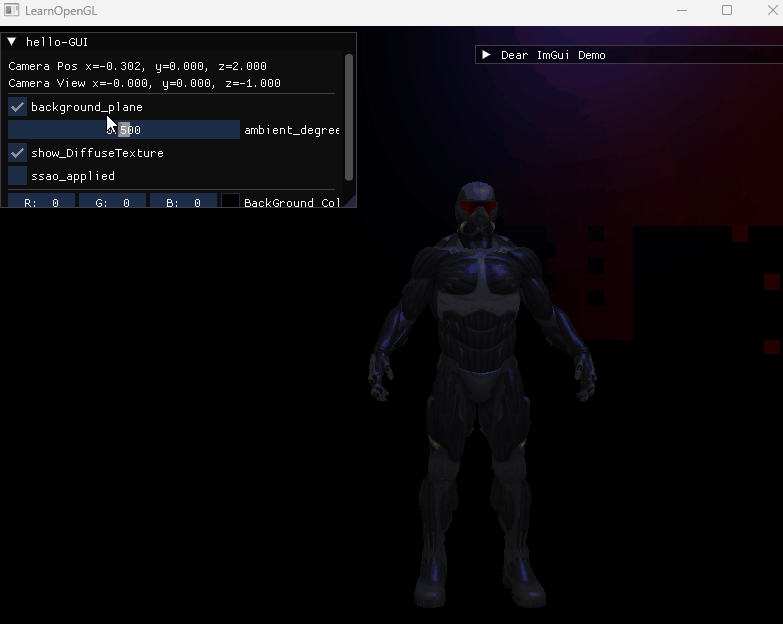

#cg #opengl
- [SSAP OpenGL教程](https://learnopengl-cn.github.io/05%20Advanced%20Lighting/09%20SSAO/)
---
# SSAO
## 什么是SSAO？

环境光照 Ambient Lighting，目的是用来模拟光的散射。

现实中光会以任意方向散射，但间接照亮的部分会存在强度变化，用以模拟这种间接光照的模拟叫做**环境光遮蔽 Ambient Occlusion**，原理是将褶皱、空洞和非常近的墙面变暗，从而模拟出间接光照

**屏幕空间环境光遮蔽 Screen-Space Ambient Occlusion，SSAO**：2007 年 Crytek 公司发布的技术，并被应用在自家游戏《孤岛危机》上
- 如其名，该技术使用的是屏幕空间场景的深度而不是真实的几何体数据来确定遮蔽量
**优点**：
- 速度快，效果好
- 是*近似实时环境光遮蔽的标准*

## 为什么需要SSAO？

现实中，到达一个被照亮位置灯光线有很多条，有的是直接照射，有的则是经过多次散射才到达，像这种直接和间接到达的光线强度是存在不同的，从而在一些褶皱、空洞等位置的亮度会相对较暗，模拟这种间接光照的技术叫做**环境光遮蔽**。

SSAO 则是由 Crytek 公司于 2007 年发布的一种在屏幕空间中进行环境光遮蔽处理的技术，速度快效果好。

## 如何实现SSAO？

原理：对铺屏四边形（Screen-filled Quad）上的每一个片段都根据周边深度值计算**遮蔽因子 Occlusion Factor**，根据遮蔽因子大小来判断该片段被其他片段遮挡的程度从而调整该片段所应该获得的环境光照分量


上图使用的是球形采样，但这种采样会导致一些平直表面，例如垂直的墙面上的球形采样仍有一般的采样点位于片段之下，从而导致墙面的 SSAO 画面效果偏暗，如下图的红框位置


另一种采样方式为，*使用一个沿着表面法向量的半球体采样核心*，如下图所示


## 代码示意

```cpp
// 1.几何处理阶段
glBindFramebuffer(GL_FRAMEBUFFER, gBuffer);
	...
glBindFramebuffer(GL_FRAMEBUFFER, 0);
// 2.利用gBuffer渲染SSAO纹理
glBindFramebuffer(GL_FRAMEBUFFER, ssaoFBO);
	glClear(GL_COLOR_BUFFER_BIT);
	shaderSSAO.Use();
	glActiveTexture(GL_TEXTURE0);
	glBindTexture(GL_TEXTURE_2D, gPositionDepth);
	glActiveTexture(GL_TEXTURE1);
	glBindTexture(GL_TEXTURE_2D, gNormal);
	glActiveTexture(GL_TEXTURE2);
	glBindTexture(GL_TEXTURE_2D, noiseTexture); SendKernelSamplesToShader();
	glUniformMatrix4fv(projLocation, 1, GL_FALSE, glm::value_ptr(projection));
	RenderQuad();
glBindFramebuffer(GL_FRAMEBUFFER, 0);
// 3.光照处理：渲染场景光照
glClear(GL_COLOR_BUFFER_BIT | GL_DEPTH_BUFFER_BIT);
shaderLightingPass.use();
...
glActiveTexture(GL_TEXTURE3);
glBindTexture(GL_TEXTURE_2D, ssaoColorBuffer);
...
RenderQuad();
```

- 阶段一：
	- 几何处理阶段，参照延迟渲染部分
- **阶段二：本节核心**
	- gBuffer 渲染 SSAO 纹理
- 阶段三：
	- 利用 SSAO 纹理应用到光照计算中

# gBuffer 渲染 SSAO 纹理
## 法向半球体

**Normal-oriented Hemisphere**

由于需要沿着表面法线方向上生成大量样本，为了减少运算量，这里需要继续使用之前提到过的**切线空间 Tangent Space**
### 生成法向半球体

```cpp
#include <random>
// 均匀分布生成0~1之间随机数
std::uniform_real_distribution<float> randomFloats(0.0, 1.0);
std::default_random_engine generator; // 作为生成随机数的种子
std::vector<glm::vec3> ssaoKernel;
// 采样点个数
GLuint sampler_nums = 64;
for(GLuint i = 0; i < sampler_nums, ++i)
{
// 生成偏离片段位置的采样向量
	glm::vec3 sample(
		randomFloats(generator) * 2.0 - 1.0,
		randomFloats(generator) * 2.0 - 1.0,
		randomFloats(generator) // Hemisphere, z rang in 0~1
	);
	sample = glm::normalize(sample);
// 设置采样点到片段位置距离
	GLfloat scale = GLfloat(i) / sampler_nums;
// 尽量让样本靠近原点分布，在0.1~1.0之间插值缩放
	scale = lerp(0.1f, 1.0f, scale * scale);
	sample *= scale;
	ssaoKernel.push_back(sample);
}
// 插值函数
GLfloat lerp(GLfloat a, GLfloat b, GLfloat f)
{
	return a + f * (b - a);
}
```

由于这个半球体定义在切线空间，那必然需要一个 TBN 矩阵，用来将这些采样点转换到其他空间中

- *本例是 SSAO 的介绍，所以会在观察空间中进行 SSAO 处理*

### 随机 TBN 矩阵

但如果按照先前创建 TBN 矩阵的方式，计算量会非常大，所以这里将建立一个比较小的**随机旋转向量**存储在纹理中，然后将该纹理平铺在屏幕上

这里创建一个 4x 4 的随机旋转向量数组：
```cpp
std::vector<glm::vec3> ssaoNoise;
GLuint random_rotate_vector_size = 4;
for(GLuint i = 0; i < random_rotate_vector_size**2; i++)
{
	glm::vec3 noise(
		randomFloats(generator)*2.0 - 1.0,
		randomFloats(generator)*2.0 - 1.0,
		0.0f // 因为沿着片段表面，所以z=0
	);
	ssaoNoise.push_back(noise);
}
```

### 噪声纹理

创建 4x 4 纹理
```cpp
GLuint noiseTexture;
glGenTexture(1, &noiseTexture);
glBindTexture(GL_TEXTURE_2D, noiseTexture);
glTexImage2D(GL_TEXTURE_2D, 0, GL_RGB16F, 4, 4, 0, GL_RGB, GL_FLOAT, &ssaoNoise[0]);
glTexParameteri(GL_TEXTURE_2D, GL_TEXTURE_MIN_FILTER, GL_NEAREST);
glTexParameteri(GL_TEXTURE_2D, GL_TEXTURE_MAG_FILTER, GL_NEAREST);
glTexParameteri(GL_TEXTURE_2D, GL_TEXTURE_WRAP_S, GL_REPEAT); 
glTexParameteri(GL_TEXTURE_2D, GL_TEXTURE_WRAP_T, GL_REPEAT);
```

# SSAO 着色器

建立好采样器后就需要利用着色器开始对帧缓冲中进行采样了

```c
#version 450 core
out float FragColor;
in vec2 TexCoords;

// gBuffer中的纹理
uniform sampler2D gPositionDepth;
uniform sampler2D gNormal;
uniform sampler2D texNoise;

// 采样器
uniform vec3 samples[64];
uniform mat4 projection; // 用以将采样向量转换到0~1

// 按照屏幕大小对噪声纹理进行拉伸
const vec2 noiseScale = vec2(800.0/4.0, 600.0/4.0);

void main()
{
	...
}
```

接下来是 main 函数体内容：

## 从 gBuffer 提取纹理

```c
vec3 fragPos = texture(gPositionDepth, TexCoords).xyz;
vec3 normal = texture(gNormal, TexCoords).rgb;
vec3 randomVec = texture(texNoise, TexCoords * noiseScale).xyz;
```
- 这里的 texNoise 就是之前设置的 TBN 噪声纹理

## 利用 texNoise 纹理建立 TBN 矩阵

```cpp
vec3 tangent = normalize(randomVec - normal * dot(randomVec, normal));
vec3 bitangent = cross(normal, tangent);
mat3 TBN = mat3(tangent, bitangent, normal);
```
- 这里用到了**Gramm-Schmidt 处理**，建立了一个正交基（Orthogonal Basis）
- **这里不需要逐顶点切线/双切向量**

## 逐样本核心迭代，并记录遮蔽的样本点占比

```c
    float occlusion = 0.0; // 记录样本点遮蔽占比
    for(int i = 0; i < kernelSize; ++i)
    {
        // get sample position
        vec3 sampler = TBN * samples[i]; // From tangent to view-space
        sampler = fragPos + sampler * radius; // 这里的fragPos在view空间中
        
        // project sample position (to sample texture) (to get position on screen/texture)
        vec4 offset = vec4(sampler, 1.0);
        offset = projection * offset; // from view to clip-space
        offset.xyz /= offset.w; // perspective divide
        offset.xyz = offset.xyz * 0.5 + 0.5; // transform to range 0.0 - 1.0
        
        // get sample depth
        float sampleDepth = -texture(gPositionDepth, offset.xy).w;
        
        // range check & accumulate
        float rangeCheck = smoothstep(0.0, 1.0, radius / abs(fragPos.z - sampleDepth ));
        occlusion += (sampleDepth >= sampler.z ? 1.0 : 0.0) * rangeCheck;           
    }
    occlusion = 1.0 - (occlusion / kernelSize);
```

下面是开启 SSAO 和关闭 SSAO 的效果对比：

| SSAO ON | SSAO OFF |
| --- | --- |
|  |  |
# 环境遮蔽模糊

上图中还是用了泛光中的模糊操作，处理 SSAO 提取的信息

- 建立 blur 帧缓冲和 blur 纹理
```cpp
GLuint ssaoBlurFBO, ssaoColorBufferBlur;
glGenFramebuffers(1, &ssaoBlurFBO);
glBindFramebuffer(GL_FRAMEBUFFER, ssaoBlurFBO);
glGenTextures(1, &ssaoColorBufferBlur);
glBindTexture(GL_TEXTURE_2D, ssaoColorBufferBlur);
glTexImage2D(GL_TEXTURE_2D, 0, GL_RED, SCR_WIDTH, SCR_HEIGHT, 0, GL_RGB, GL_FLOAT, NULL);
glTexParameteri(GL_TEXTURE_2D, GL_TEXTURE_MIN_FILTER, GL_NEAREST);
glTexParameteri(GL_TEXTURE_2D, GL_TEXTURE_MAG_FILTER, GL_NEAREST);
glFramebufferTexture2D(GL_FRAMEBUFFER, GL_COLOR_ATTACHMENT0, GL_TEXTURE_2D, ssaoColorBufferBlur, 0);
if (glCheckFramebufferStatus(GL_FRAMEBUFFER) != GL_FRAMEBUFFER_COMPLETE)
    std::cout << "SSAO Blur Framebuffer not complete!" << std::endl;
glBindFramebuffer(GL_FRAMEBUFFER, 0);
```

- 模糊着色器
```c
#version 450 core
in vec2 TexCoords;

out float fragColor;

uniform sampler2D ssaoInput;
const int blurSize = 4; // use size of noise texture (4x4)

void main() 
{
   vec2 texelSize = 1.0 / vec2(textureSize(ssaoInput, 0));
   float result = 0.0;
   for (int x = 0; x < blurSize; ++x) 
   {
      for (int y = 0; y < blurSize; ++y) 
      {
         vec2 offset = (vec2(-2.0) + vec2(float(x), float(y))) * texelSize;
         result += texture(ssaoInput, TexCoords + offset).r;
      }
   }
 
   fragColor = result / float(blurSize * blurSize);
}
```

# 应用环境遮蔽

至此已经获得了需要的**环境光遮蔽因子**，最后就剩下将该因子应用到环境光计算上

- 延迟光照着色器如下
```c
#version 450 core
out vec4 FragColor;
in vec2 TexCoords;

uniform sampler2D gPositionDepth;
uniform sampler2D gNormal;
uniform sampler2D gAlbedo;
uniform sampler2D ssao;

struct Light {
    vec3 Position;
    vec3 Color;
    
    float Linear;
    float Quadratic;
};
uniform Light light;

uniform bool ssao_applied;
uniform float ambient_degree;

void main()
{             
    // Retrieve data from g-buffer
    vec3 FragPos = texture(gPositionDepth, TexCoords).rgb;
    vec3 Normal = texture(gNormal, TexCoords).rgb;
    vec3 Diffuse = texture(gAlbedo, TexCoords).rgb;
    float AmbientOcclusion = texture(ssao, TexCoords).r;
    
    // Then calculate lighting as usual
    vec3 ambient = ambient_degree * Diffuse;
    if(ssao_applied)
        ambient *= AmbientOcclusion; // <-- this is where we use ambient occlusion
        
    vec3 lighting  = ambient; 
    vec3 viewDir  = normalize(-FragPos); // Viewpos is (0.0.0)
    // Diffuse
    vec3 lightDir = normalize(light.Position - FragPos);
    vec3 diffuse = max(dot(Normal, lightDir), 0.0) * Diffuse * light.Color;
    // Specular
    vec3 halfwayDir = normalize(lightDir + viewDir);  
    float spec = pow(max(dot(Normal, halfwayDir), 0.0), 32.0);
    vec3 specular = light.Color * spec;
    // Attenuation
    float distance = length(light.Position - FragPos);
    float attenuation = 1.0 / (1.0 + light.Linear * distance + light.Quadratic * distance * distance);
    diffuse *= attenuation;
    specular *= attenuation;
    lighting += diffuse + specular;

    FragColor = vec4(lighting, 1.0);
}
```

*重点在环境光计算中需要乘上该遮蔽因子*，其他部分的光照计算正常进行

最后展示附上贴图后开启关闭 SSAO 的效果对比：




