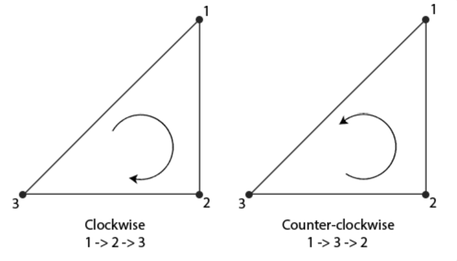

# 4.4 Face Culling 面剔除

#cg #opengl

---

- 面剔除
  - 是什么？
  - 为什么？
  - 怎么做？

## 是什么？

一种筛选绘制面的规则，不去绘制看不见的面从而减少渲染开销的一种手段


## 为什么？

一个3D空间的立方体，从任意角度能看到最大的面数是3，则其余3个面是不必要绘制的，从而减少调用片段着色器的次数（50%以上）
- 片段着色器在渲染中的开销很大


## 怎么做？

- 定义一个顶点的环绕方式（Winding Order）
- 找出面向（Front Facing）观察者的面和背对（Back Facing）观察者的面
- 设置渲染规则，只渲染面向（Front Facing）观察者的正向面（Front Face）

### 环绕顺序 Winding Order

- 定义一组三角形顶点时，会按照某种顺序来排序顶点，如顺时针方向（Clock-Wise），或逆时针方向（Counter-clockwise），如图：

**OpenGL中一般以逆时针方向作为正向面**

### OpenGL中的面剔除

- 启动面剔除
```cpp
glEnable(GL_CULL_FACE);
```
- 设置想要剔除的面
```cpp
// 这里将目标剔除的面，设置为正向面
glCullFace(GL_FRONT);// 默认值为背向面
// 三个参数：GL_FRONT, GL_BACK, GL_FRONT_AND_BACK
```

- 规定正向面的顶点环绕顺序
```cpp
// 将正向面顶点环绕顺序设置为逆时针方向
glFrontFace(GL_CCW); // GL_CW 顺时针方向
```

