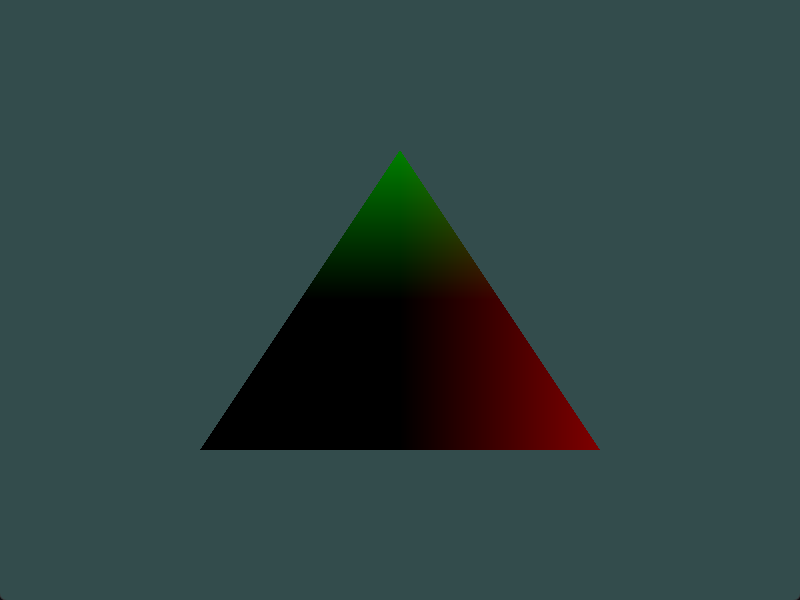

# 1. 测试

修改顶点着色器让三角形上下颠倒

```cpp
gl_Position = vec4(aPos.x, -aPos.y, aPos.z, 1.0f);
```


# 2. 测试

使用uniform定义一个水平偏移量，在顶点着色器中使用这个偏移量把三角形移动到屏幕右侧

[作业2](./assign02/)

修改文件为：
- [vs.shader](assign02/shaders/vs.shader)
  - 增加`uniform float x_offset;`
  - 修改`gl_Position.x = aPos.x + x_offset;`
- [main.cpp](assign02/src/main.cpp)
  - 渲染循环中：`ourShader.setFloat("x_offset", offset);`


# 3. 测试

使用out关键字把顶点位置输出到片段着色器，并将片段的颜色设置为与顶点位置相等（来看看连顶点位置值都在三角形中被插值的结果）。做完这些后，尝试回答下面的问题：为什么在三角形的左下角是黑的?

[作业3](assign03/)

修改文件为：
- [vs.shader](assign03/shaders/vs.shader)
  - `vertexColor = gl_Position;`

输出图像：



三角形三个顶点分别为：
- 上顶点：(0.5f, -0.5f, 0.0f),
- 左顶点：(-0.5f, -0.5f, 0.0f),
- 右顶点：(0.0f,  0.5f, 0.0f)

颜色向量的三个数值分别对应red、green、blue，在和位置坐标绑定后这三个数值即为对应坐标的坐标轴分量数值。

左下角为黑色的原因，颜色数值为0~1之间，而左顶点的坐标数据均小于等于0，导致三种颜色都无法显示，从而出现黑色。