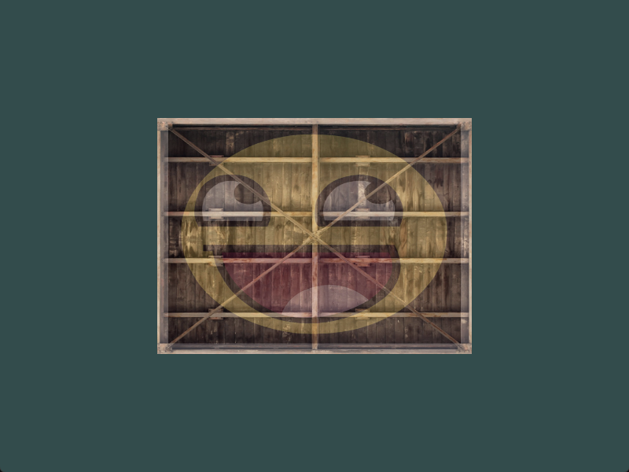
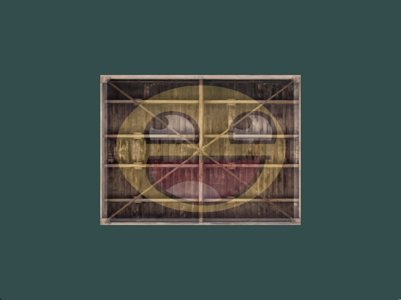
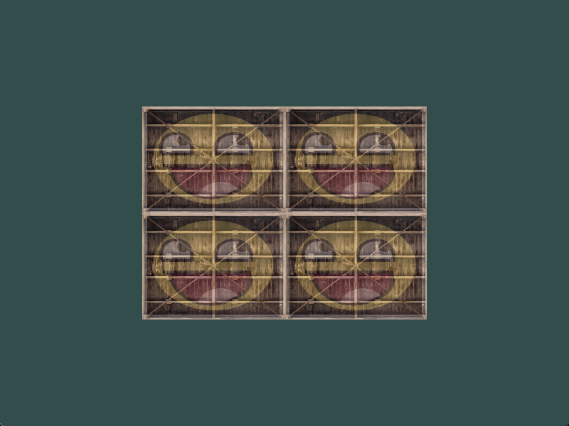
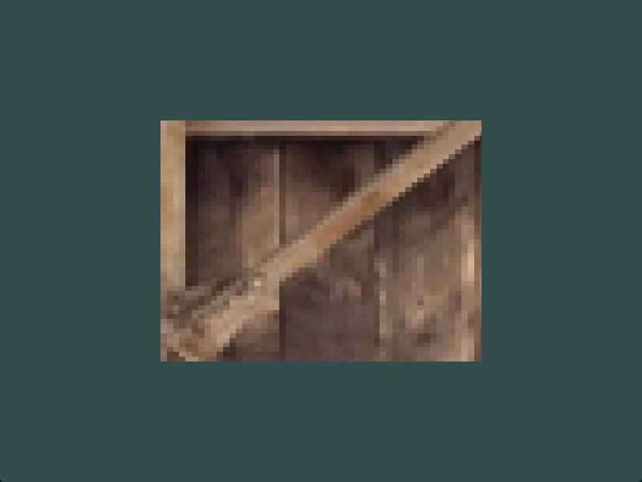

#cg #opengl

为了更熟练地使用纹理，建议在继续之后的学习之前做完这些练习：

1. 修改片段着色器，**仅**让笑脸图案朝另一个方向看

解：

根据题意，**只让笑脸图案做以y轴对称**，所以需要修改顶点对应的纹理坐标，并且*分别指明笑脸图案和木箱图案的对应纹理坐标*。

个人修改方案如下：

修改顶点属性，将纹理坐标增加一列，因为经过只需要让笑脸图案翻转，所以需要特别指明反转后的坐标（即纹理坐标的中间那一列）

```cpp
float vertices[] = {
//     ---- 位置 ----       ---- 颜色 ----     - 纹理坐标 -
    0.5f,  0.5f, 0.0f,   1.0f, 0.0f, 0.0f,   1.0f, 0.0f, 1.0f,   // 右上
    0.5f, -0.5f, 0.0f,   0.0f, 1.0f, 0.0f,   1.0f, 0.0f, 0.0f,   // 右下
    -0.5f, -0.5f, 0.0f,   0.0f, 0.0f, 1.0f,   0.0f, 1.0f, 0.0f,   // 左下
    -0.5f,  0.5f, 0.0f,   1.0f, 1.0f, 0.0f,   0.0f, 1.0f, 1.0f    // 左上
};
```

由于修改了顶点属性，则在设置属性指针对象时，需要指明此时材质属性长度由2变为3，同时还需要修改步长（`8*sizeof(float)` 变为 `9*sizeof(float)`），而每种属性的`offset`不变，下边只给出材质属性指针的修改，其余只需要修改步长

```cpp
/* 材质属性指针 */
glVertexAttribPointer(2, 3, GL_FLOAT, GL_FALSE, 9*sizeof(float), (void*)(6*sizeof(float)));
glEnableVertexAttribArray(2);
```

对应的，还需要修改顶点着色器和片段着色器

顶点着色器中，修改`TexCoord`为`vec3`类型。
片段着色器中，同样修改其类型，重点在使用texture函数采样纹理颜色的时候，这里需要分别针对两个采样器指明不同的纹理坐标（*只需要将`TexCoord`的三个坐标按照预先决定好的方式组合即可*），如下：

```cpp
FragColor = mix(texture(vertexTexture0, vec2(TexCoord.x,TexCoord.z)), texture(vertexTexture1, vec2(TexCoord.y,TexCoord.z)), 0.2);
```

修改前为：
修改后为：

*同时没有改变木箱的纹理映射*

---

2. 尝试用不同的纹理环绕方式，设定一个从0.0f到2.0f范围内的（而不是原来的0.0f到1.0f）纹理坐标。试试看能不能在箱子的角落放置4个笑脸。记得一定要试试其它的环绕方式。

解：

直接将纹理坐标修改为0.0f到2.0f范围，环绕方式为`GL_REPEAT`，得到结果如图：

略。

---

3. 尝试在矩形上只显示纹理图像的中间一部分，修改纹理坐标，达到能看见单个的像素的效果。尝试使用GL_NEAREST的纹理过滤方式让像素显示得更清晰。

修改纹理坐标：
```cpp
float p_min = 0.5f;
float p_max = 0.4f;
```
并修改过滤方式为：`GL_NEAREST`，结果如下图：



---

4. 使用一个uniform变量作为mix函数的第三个参数来改变两个纹理可见度，使用上和下键来改变箱子或笑脸的可见度

解：在片段着色器中声明一个uniform变量，随后在main.cpp中的processInput函数中检测按键输入，分别对这个uniform变量进行加减操作。


---

