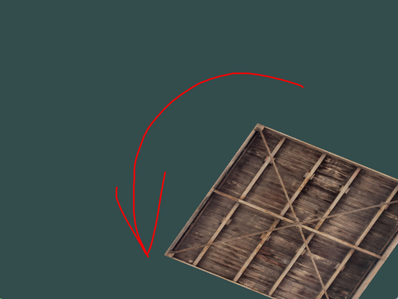
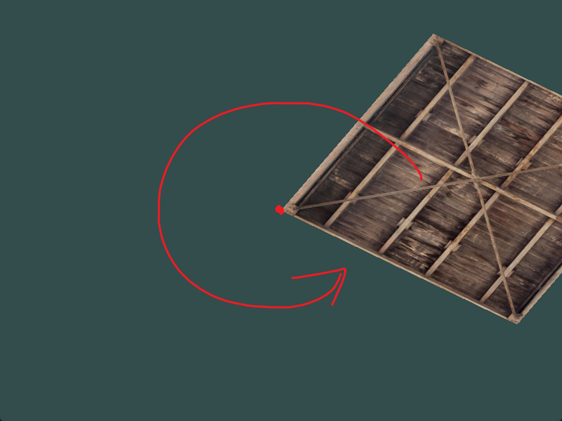

#cg #opengl

---
练习 01：

> 使用应用再箱子上的最后一个变换，尝试将其改变为先旋转，后位移。

解：

未修改前（代码中先位移后旋转）：箱子移动到右下角，然后在右下角绕自身中心旋转



修改后（代码中先旋转后位移）：箱子先移动到右下角，然后绕自身左上角进行旋转



情况 1：先位移再旋转的坐标矩阵推导：

$$
\begin{bmatrix*}
\cos\theta & -\sin\theta & 0 & 0 \\
\sin\theta & \cos\theta & 0 & 0\\
0 & 0 & 1 & 0\\
0 & 0 & 0 & 1
\end{bmatrix*}\cdot\begin{bmatrix*}
1 & 0 & 0 & T_x \\
0 & 1 & 0 & T_y \\
0 & 0 & 1 & T_z \\
0 & 0 & 0 & 1
\end{bmatrix*}\cdot\begin{bmatrix*}
x \\ y \\ z \\ 1
\end{bmatrix*}=\begin{bmatrix*}
(x+T_x)\cos\theta - (y+T_y)\sin\theta \\
(x+T_x)\sin\theta + (y+T_y)\cos\theta \\
z+T_z \\
1
\end{bmatrix*}

$$

情况 2：先旋转再位移的坐标矩阵推导：

$$
\begin{bmatrix*}
1 & 0 & 0 & T_x \\
0 & 1 & 0 & T_y \\
0 & 0 & 1 & T_z \\
0 & 0 & 0 & 1
\end{bmatrix*}\cdot\begin{bmatrix*}
\cos\theta & -\sin\theta & 0 & 0 \\
\sin\theta & \cos\theta & 0 & 0\\
0 & 0 & 1 & 0\\
0 & 0 & 0 & 1
\end{bmatrix*}\cdot
\begin{bmatrix*}
x \\ y \\ z \\ 1
\end{bmatrix*}=\begin{bmatrix*}
x\cos\theta - y\sin\theta+T_x \\
x\sin\theta + y\cos\theta+T_y \\
z+T_z \\
1
\end{bmatrix*}
$$

注意到，由于我们这里设置了旋转角度随时间变化。
- 如果先应用位移，会导致*位移的方向也会被旋转矩阵改变*，从而出现了绕边缘点旋转的效果
	- 而且可以观察到其旋转半径为 $\sqrt{2(T_x^2\cos^2\theta+T_y^2\cos^2\theta)}$
	- 代码中 $|T_x|=|T_y|=0.5$ 所以实际旋转半径为 $\frac{\sqrt{2}}{2}$，正好是绘制的方形对角线的一半
- 如果先应用旋转，位移操作在旋转之后再发生，位移操作不会收到旋转的影响


**代码中添加变换矩阵的顺序是书面从左到右的顺序，而阅读顺序应该是从右到左**，所以：
- 代码中先位移后旋转，在阅读顺序中为**先旋转后位移**，对应的是情况 2 和图 1；
- 代码中先旋转后位移，在阅读顺序中为**先位移后旋转**，对应的是情况 1 和图 2


练习 02：

> 尝试再次条用 glDrawElements 画出第二个箱子，只是用变换将其摆放在不同位置，如左上角，并且会不断缩放（而不是旋转）（可以使用 sin 函数，要注意 sin 函数为负值时会导致物体被翻转）

解：

```cpp
trans = glm::mat4(1.0f);
trans = glm::translate(trans, glm::vec3(-0.5f, 0.5f, 0.0f));

auto scale_size = fabs(sin(time));
trans = glm::scale(trans, glm::vec3(scale_size));
glUniformMatrix4fv(transformLoc, 1, GL_FALSE, glm::value_ptr(trans));

 /* 开始渲染 */
glBindVertexArray(VAO); // 绑定VAO
glDrawElements(GL_TRIANGLES, 6, GL_UNSIGNED_INT, 0);
```


